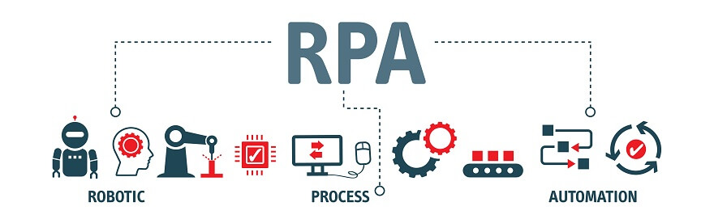
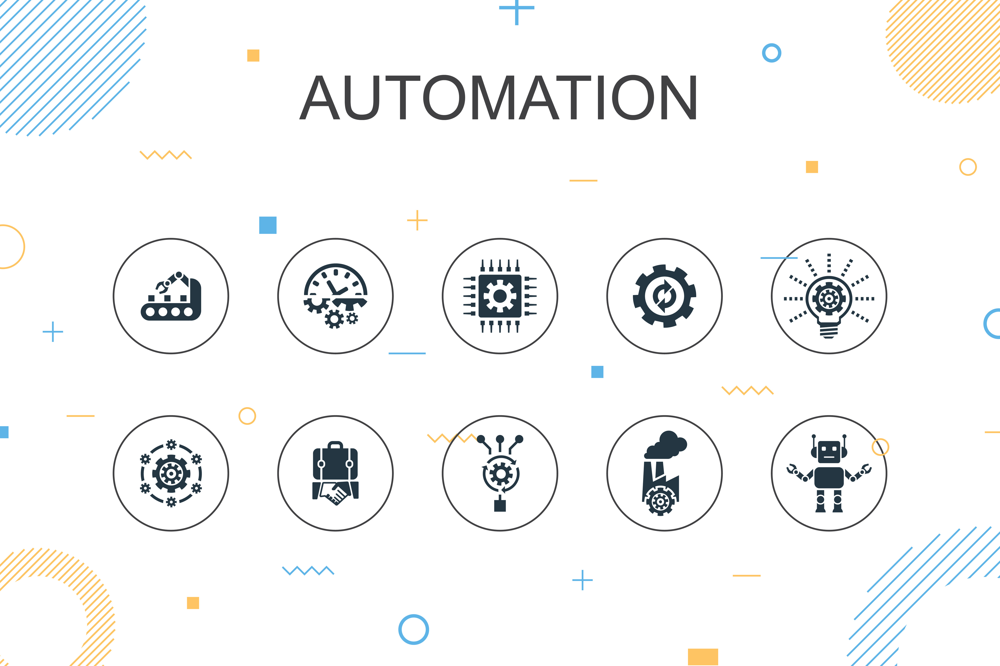
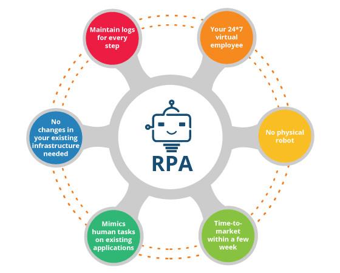
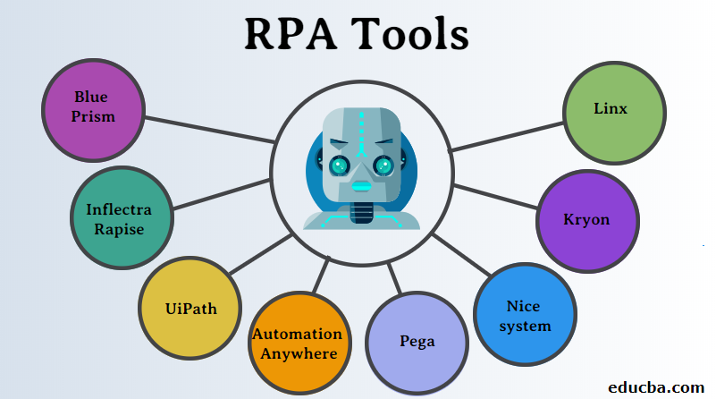
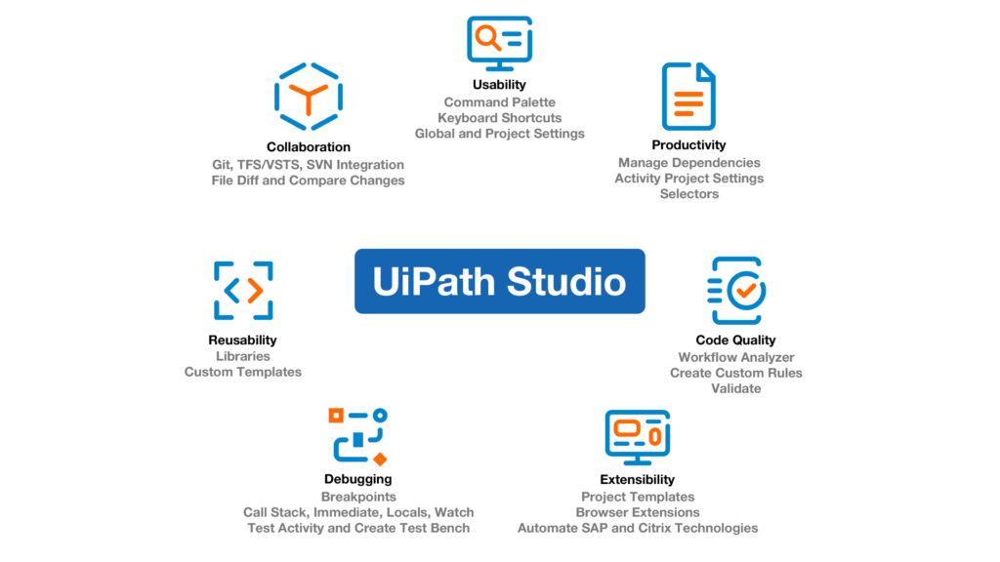
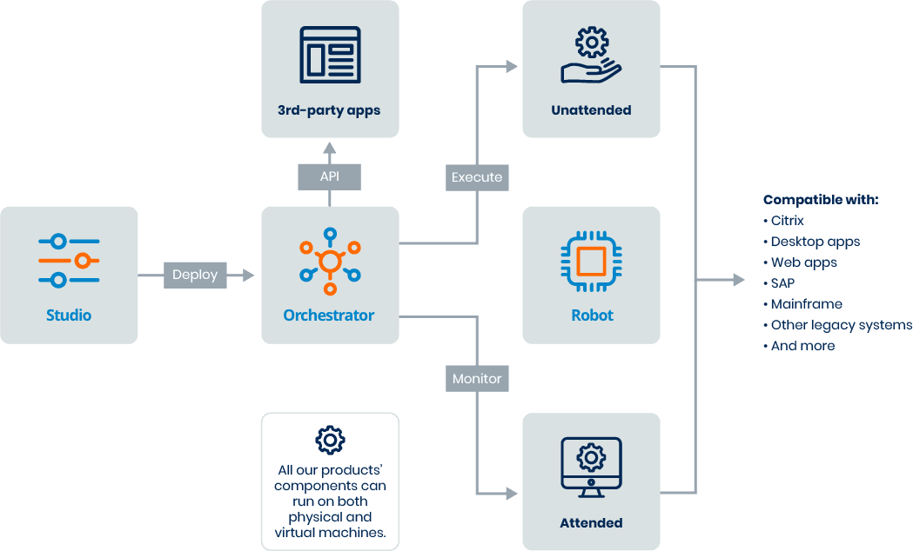
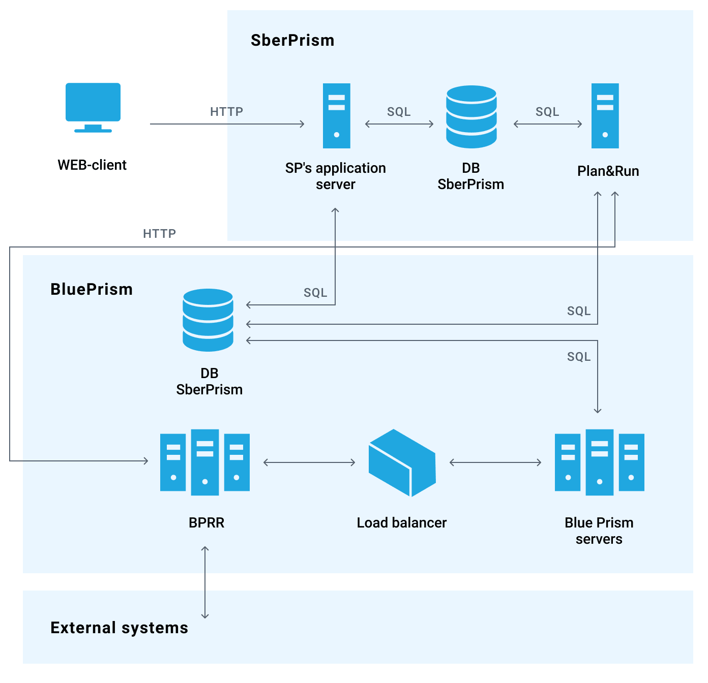
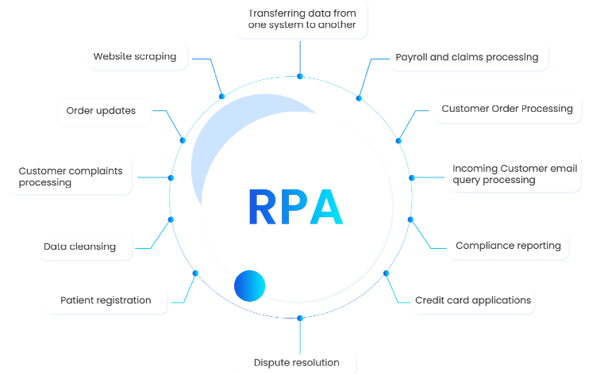
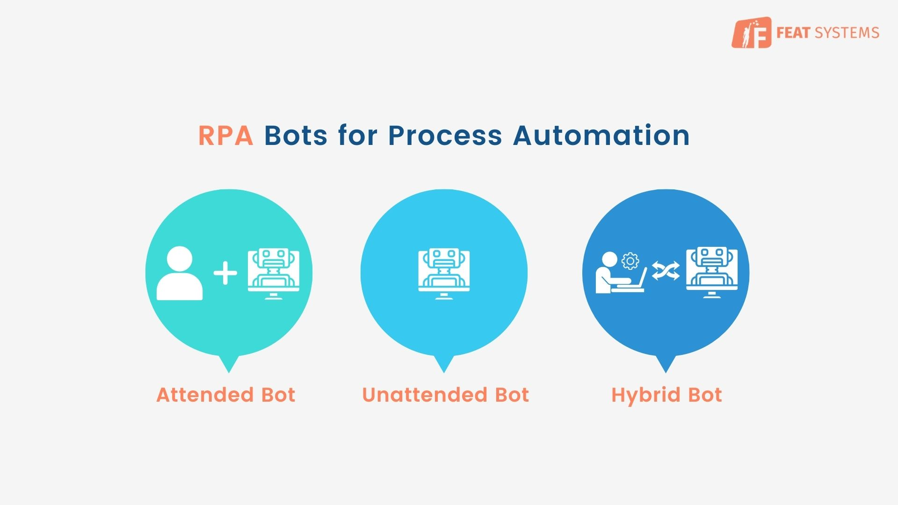

# RPA (Robotic Process Automation)

<!--  -->

## Conceituação e Contexto
Automação robótica de processos → no uso de softwares serve para automatizar processos que envolvem tarefas repetitivas em sistemas digitais

- Análise de requisições de compras
- Pesquisa e atualização de tabelas
- Envio de emails

Os robôs mimetizam ações dos usuários no user interface, fazendo a captura de dados e agindo sobre programas, realizando ações como:

- Clicar e digitar
- Abrir e salvar arquivos
- Download e upload de arquivos
- Captura de informações em planilhas, arquivos d textos e PDFs
- Preenchimento de formulários
- Extração de relatórios
- Verificações e comparações

Essas ações são realizadas seguindo regras e a sequência determinada pelo desenvolvedor, contando com loops, desvios condicionais e outros recursos

**A automatização via RPA:**

- Não interfere fortemente na estrutura nem na arquitetura de software da organização, pode ter um carácter localizado
- Envolve implementações mais periféricas, rápidas e relativamente baratas (incrementais)

***

## Benefícios

Apresentam como vantagens a agilidade para conclusão dos processos, a diminuição do erro humano e sua disponibilidade, além de muitas vezes permitir que o usuário trabalhe em outras tarefas (que não podem ser automatizadas) enquanto o RPA é executado

- Transferência de pessoas de tarefas repetitivas para trabalhos mais sensíveis que não podem ser automatizados
- Aumento da velocidade e redução de falhas em trabalhos automatizados
- Disponibilidade 24/7, sem atuação humana
- Redução de custos
- Escalabilidade
- Melhoria de resultados, com ciclos mais curtos nos processos
- Possibilidade de automação mais rápida (ciclo de implementação de robôs em semanas ou meses)

***

## Principais Ferramentas de RPA

**UiPath ↓**

- Muitos parceiros tecnológicos
- Ampla comunidade de usuários
- Atualizações frequentes
- Precificação complexa, mais focado em novidades do que em suporte a versões anteriores

<!--  -->

**Automation Anywhere ↓**

- Plataforma cloud robusta
- Usabilidade
- Recursos inovadores
- Precificação transparente e competitiva
- Alguma dificuldade com deploys e upgrades
- Algumas features antigas poderiam receber melhorias

**Blue Prism ↓** 

- Bons recursos
- Ampla comunidade de usuários e experts em 42 indústrias específicas
- Não possui gravador de processos
- Preço um pouco mais elevado
- Problemas no suporte dos upgrades
- Usabilidade mais complexa

***

## O Que Pode Ser Automatizado Pelo RPA?

Qualquer processo repetitivo, de alto volume, executado pelo computador, é elegível para automação via RPA

- Processamento de pedidos
- Conciliação bancária
- Envio de notificações
- Cobranças de clientes
- Análise de crédito
- Realização de pagamentos
- Atualização de cadastros

Todas as tarefas fazem o uso das interações com a interface (mouse e teclado) e são sequências, quase como uma receita

1. Copiar uma linha do excel
2. Colar em um campo de um form
3. Clicar em um botão de salvamento no form
4. Repetir até passar por todas as linhas que estão preenchidas

O desenvolvimento de um robô RPA é basicamente definir as necessidades e separar o trabalho em uma sequência de tarefas

***

## RPA no Contexto da Automação

**Orientado a Processos ↓**

- (4) Robotic Desktop Automation [RDA] → automatização de processos com intervenção manual
- (3) Robotic Process Automation [RPA] → automatização de processos com gatilhos digitais e self-service

**Orientado a Dados ↓**

- (2) Machine Learning [ML] → automatização com análise de dados e modelos de decisão
- (1) Artificial Intelligence [AI] → automatização que tende a "imitir" a inteligência humana

***

## Roadmap de Implementação

**Na área de TI ↓**

→ Capacitação para TI 
→ CoE (Center of Excellence) 
- Seleção e implementação de ferramenta
- Pilotos/Análises de impactos

→ Criação do primeiro robô (piloto, nem muito relevante ou crítico)
→ Monitoração técnica
→ CoE
- Desenvolvimento de novos robôs, disseminação e acompanhamento

**Na área de Negócios ↓**

→ Capacitação para Negócios
→ Seleção de processos a automatizar

→ Criação do primeiro robô (piloto, nem muito relevante ou crítico)
→ Uso do primeiro robô
→ Governança de processos/automação
- Desenvolvimento de novos robôs, disseminação e acompanhamento

***

## Alternativas de Implementação

**→ On-premise (infraestrutura local)**

**Vantagens:**
- Maior variedade de opções de plataforma
- Governança local
- Mais barata a longo prazo

**Desvantagens:**
- Implementação mais lenta
- Setup mais complexo
- Requer pessoal treinado na organização para manter

**→ Cloud (infraestrutura externa)**

Costuma adquirir um carácter SaaS (Software as a Service), pois além da infraestrutura há também programação e sustentação de robôs. Comercialmente, existe o termo RaaS (Robot as a Service)

**Vantagens:**
- Implementação mais rápida
- Plataforma mais restada
- Setup mais simples
- Menos dependência da TI local

**Desvantagens:**
- Plataforma e políticas limitadas pelo fornecedor
- Mais caro a longo prazo
- Limitação a relatórios padrão

***

## Funcionalidades em Ferramentas 

**Configuração via "drag and drop"**

- Cria fluxos de automação sem necessidade de codificar
- Aproxima a criação de robôs a áreas menos técnicas
- Configuração mais rápida e visual

**Gravação de fluxo de trabalho**

- Usuário executa o trabalho e a ferramenta grava cada ação feita em tela
- O autômato capta as atividades e a sequência para poder reproduzir depois

**Disponibilidade de modelos pré-configurados**

- Apresenta templetes de automação para adoção/adaptação
- Acelera a criação de robôs mais comuns

**Visão computacional e processamento de linguagem natural (AI/ML)**

- Nas soluções mais sofisticadas há a capacidade de "entender" palavras e ícones que elas "veem" durante as gravações do fluxo de trabalho
- Podem executar processo de maneira precisa

**Integração com aplicativos de negócios**

- São comuns integrações com ERPs e CRMs
- Os robôs trabalham em conjunto com os sistemas nas tarefas "mecânicas"

**Programação do disparo de robôs**

- Permite que os robôs entrem em ação em determinados horários ou por meio da ocorrência de certos gatilhos

**Análise de desempenho de robôs**

- Análise e painéis (dashboards) para rastrear a correção e eficiência do trabalho dos robôs

***

## Impacto Organizacional e Humano do RPA

**Organizacional ↓**

- Reduz trabalho repetitivo, economizando horas de pessoas operacional, mas..
- exige horas de trabalho em CoEs, etc

É necessário fazer uma balanceamento de custo/benefício (análise de ROI)

- Um processo ruim não se torna bom só por ser automatizado
- Antes de automatizar, é de suma importância rever o processo, para que não sejam usados recursos em atividades que poderiam ser, por exemplo, eliminadas

**Humano ↓** 

- Libera o pessoal de trabalhos repetitivos, entediantes, mecânicos, etc
- Pode acabar substituindo os funcionários, causando uma movimentação de pessoas