# UiPath StudioX

## Interface

***

## Anatomia de uma Atividade

Atividades são os blocos de construção da automação. É um grupo de instruções que o robô segue para performar a tarefa. O Studio e StudioX usam atividades para montar a automação

No StudioX existem 2 tipos de atividades, cada uma com seus próprios propósitos 

**Recursos ↓** 

São as atividades que dizem ao robô que aplicativo usar. Essas são aplicativos dedicados, como Office apps, ou genéricos

Quando são dedicados, é necessário especificar o documento ou conta de email para que possam ser usados na automação

O genérico Application/Browser serve para indicar outros aplicativos e navegadores. Para indicar um aplicativo, ela já deve estar aberta (rodando)

**Ações ↓**

São atividades que dão ao robô instruções do que fazer com os recursos. São agrupados de acordo com o propósito do aplicativo

Algumas ações dependem do recurso. Como exemplo, não se pode usar ações do Word em um arquivo Excel. As exceções são as ações comuns que podem ser usadas em qualquer aplicativo e as ações de arquivo que não precisam de um recurso

As ações são nomeadas baseado nas ações comuns que performam em certas aplicações

### Diferença entre Step, Task and Process

**Steps (passos) →** é uma ação necessária para completar um propósito específico e bem definido

ex: baixar uma planilha 

**Tasks (tarefas) →** sequência de steps realizados por operador (humano/manual, robô/automatizado)

ex: juntar dados de 2 arquivos diferentes e salva em um novo arquivo numa pasta local

**Processes (processos) →** múltiplas, inter-relacionadas tarefas constroem um processo que almeja alcançar um objetivo maior. Pode ser um grupo de ambas tarefas automatizadas e manuais

ex: requisição de compra que precisa de múltiplos sistemas e requer validação humana para enviar 

***

## HumanPath para RobotPath

Framework que ajuda a organizar a tarefa de uma maneira visual. Também ajuda há traduzir a tarefa para o que é conhecido como "robot language" (linguagem do robô)

**HumanPath →** visualização high-level de tarefa em uma maneira sequencial

**RobotPath →** visualização detalhada, esta moldando o design dos steps que o robô leva para automatizar a tarefa

**Vantagens:**

- Quebra o processo em pequenos passos lógicos
- Ajuda a moldar o escopo do que se quer construir
- Outlines pontos de decisões-chave e cenários de tarefas de automação
- Serve para guiar na construção do robô 

### Como usar?

**HumanPath**

- A tarefa deve sempre começar com um **Start**
- Tudo deve estar conectado com flechas, não deixe nada independente
- Cada passo deve ter uma etiqueta de aplicativo, indicando onde cada ação acontece
- Todo começo tem um final, termine o flow com um **END**

**RobotPath**

- Deve começar de mesma forma que o HumanPath, com um **Start**
- Tudo deve estar conectado com flechas, não deixe nada independente
- Ás vezes o robô tem que tomar decisões entre 2 ou mais opções, dependente de uma condição de verificação, ou repetir ações para certo item
- Cada passo deve ter uma etiqueta de aplicativo, indicando onde cada ação acontece
- Quebre cada passo a nível de clique. Todo passo deve ser precisamente definido e só pode ter um significado
- Os passos devem seguir uma ordem específica. Uma falha na ordem significa um resultado provavelmente incorreto
- Todo começo tem um final, termine o flow com um **END**

[Template para construir ambos os caminhos](HumanPath%20-%20RobotPath%20Templates%20-StudioX.pptx)

***

## User Interface

É uma série de telas, páginas e elementos visuais - como botões e campos de input - que permitem a interação com o aplicativo. StudioX, por meio de seu pacote de atividades, imita a forma como o usuário interage com as aplicações e reconhece os elementos da interface independente de posição, resolução ou tamanho de fonte 

Todas as interações com o UI podem ser divididas em input (enviar ou adicionar algo o aplicativo) e output (obter algo do aplicativo). Clicar um botão e escrever em uma caixa de texto são exemplos de input, já obter o texto de uma página no navegador é um exemplo de output

No StudioX há 2 maneiras de se automatizar um processo:

- Adicionando atividades passo-a-passo
- Utilizando o recurso "Web/App Recorder" para gravar as ações do usuário

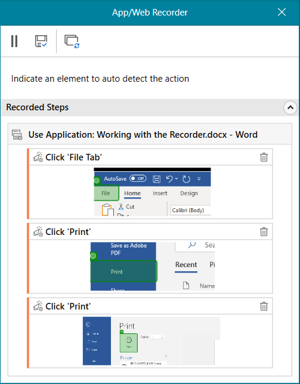

O gravador só irá funcionar em automações da Interface do Usuário. Não irá funcionar em tarefas que envolvem Excel, Email, Word ou automação de arquivos e pastas.

Atividades input veem com uma propriedade chamada **Input Mode**

### Input Mode

Algumas automações tomam controle do mouse, então impedindo que o usuário possa usar o computador. Para que os projetos possam ser executados em background, sem que afete o uso do computador, é necessário mudar o modo de input no painel de propriedades. Há 2 tipos:

- **Hardware Events →** simulam a ação usando o driver de hardware. É o método mais lento, não pode ser executado em segundo plano, mas é compatível com todos os desktop apps e é o modo padrão
- **Simulate →** simula o modo input da maneira mais rápida e funciona em segundo plano, mas é limitado para certas situações. Por exemplo, só funciona com clique simples (mouse esquerdo) ou se o texto para digitar não inclui caracteres especiais

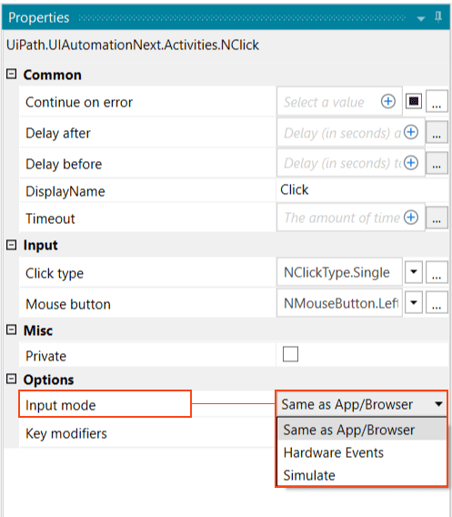

- **Same as App/Browser →** implica que a ação irá usar o mesmo modo de input do recurso Use Application/Browser em que está inserido

***

## Unified Target

É um framework para UI Automation. Atividades como clicar, digitar e, mais importante, localizar os elementos corretamente na tela, estão aprimorados pelo método de unificação de segmentos dos elementos UI para automação

Usando um framework unificado todos os métodos apoiam uns aos outros para maior confiabilidade, assim pode-se garantir que o robô irá superar qualquer roadblock causado por pontos fracos na seleção de elementos UI 

**UI Frameworks**

Por padrão, um proprietary framework é usado para acessar os segmentos da janela do aplicativo, no entanto, se a segmentação não é detectada, StudioX tem 2 alternativas:

- **Active Accessibility →** para aplicativos mais antigos
- **UIA (Microsoft UI Automation →** para aplicativos mais novos

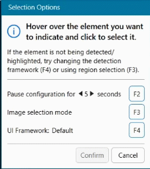

Depois de selecionar um segmento, a opção para mudar de framework não estará mais disponível

### Debugging & Troubleshooting

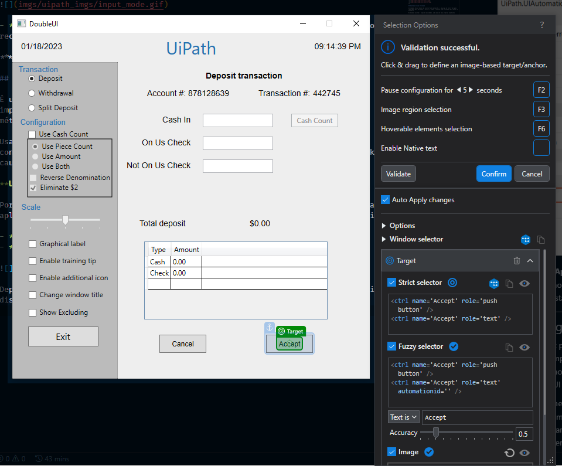

**Check App State**

É útil para situações onde se quer checar se o aplicativo que irá automatizar existe

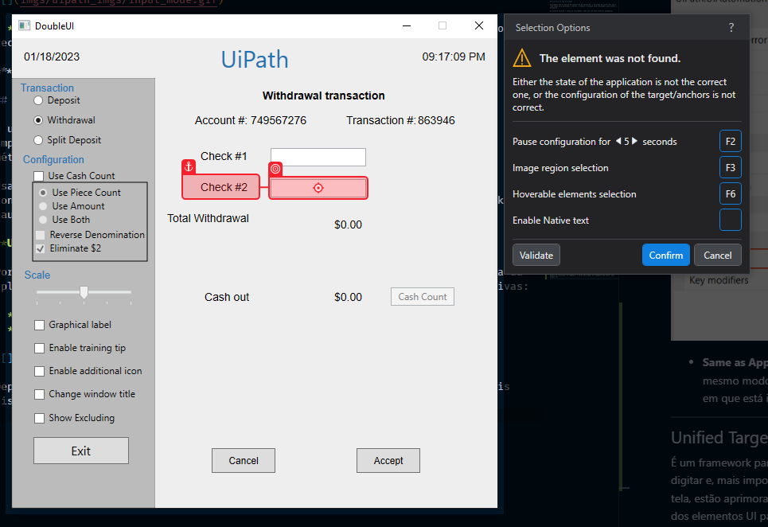

Pense em abas diferentes em um aplicativo ou navegador. Quando se está adicionando atividades para o workflow, é necessário ter certeza de que se está selecionando os elementos ou abas corretas. Além disso, caso um elemento não seja encontrado é possível adicionar outro conjunto de atividades para serem executadas

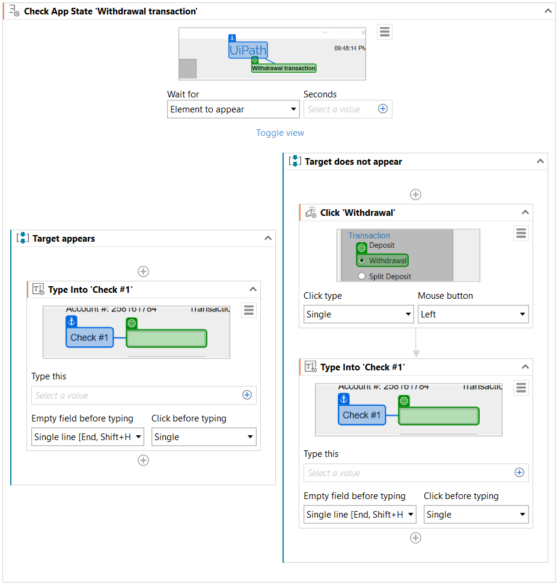

O tempo para achar o elemento antas da execução da próxima atividade pode ser alterado na opção **Wait For It**

**Show All Matches**

É usado para encontrar todas os matches para o elemento selecionado no aplicativo

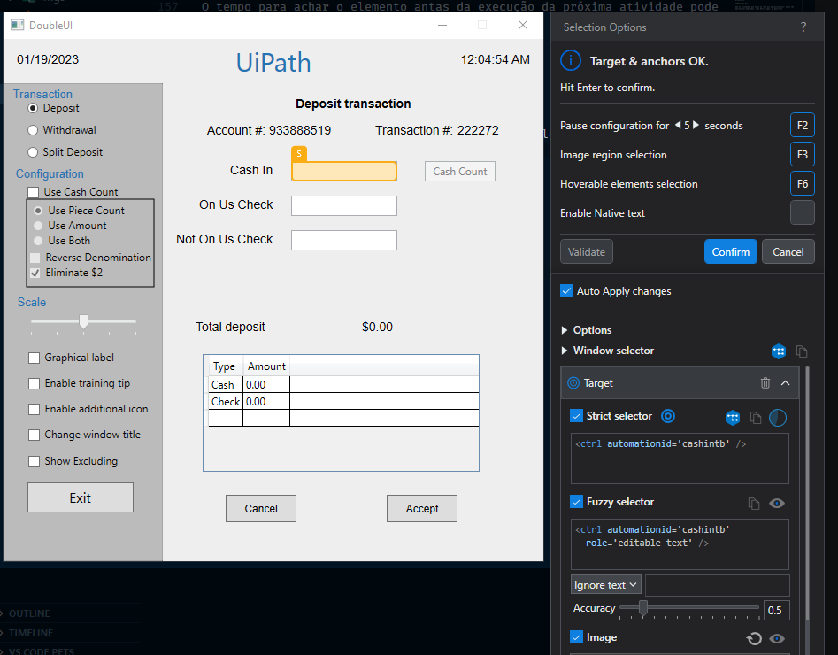
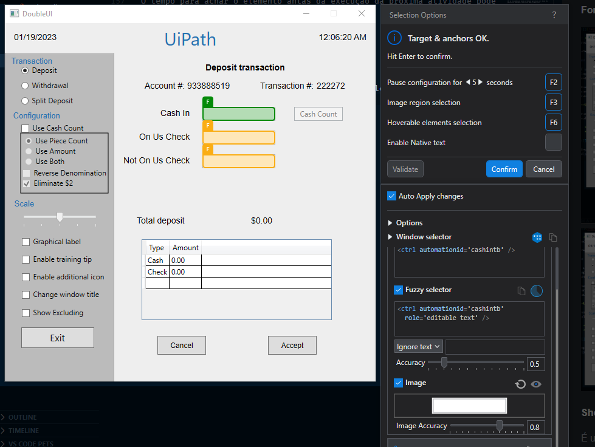

**Image Selection Mode**

É útil para selecionar um segmento ou âncora que não está disponível em um único clique

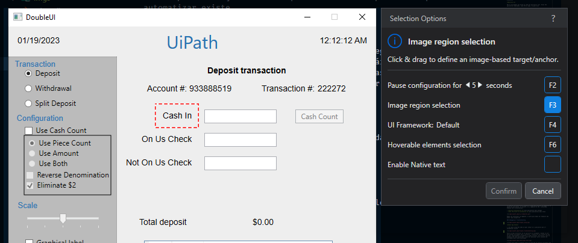
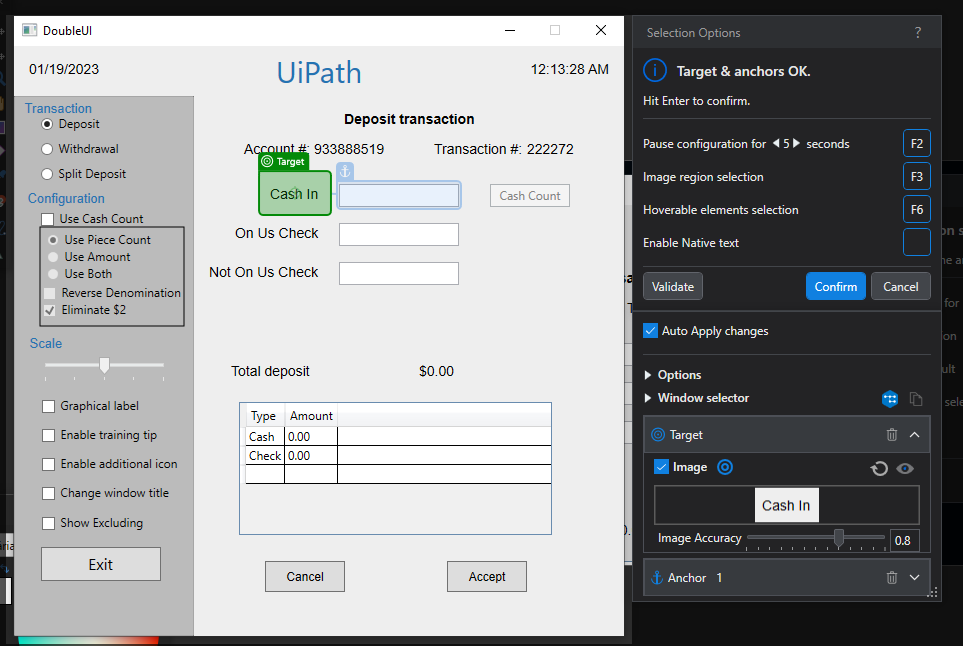

***

## Automação do Word (office)

Alguns capacidades de automação com o Word são:

- Substituir fotos e textos
- Adicionar fotos, anexar textos no final do documento, inserir tabelas em posições especificas relativas ao texto ou um marcador e definir marcadores de conteúdo
- Exportar como PDF ou usar para preencher emails

Para substituir fotos é necessário indica-las pelo seu texto alt. Ao contrário do Excel não se pode indicar os elementos do Word diretamente pelo Ui Path, é preciso escrever a referência do que se vai mudar

****

## Decisões, Iterações e Cenários  

Em alguns projetos pode ser necessário que o robô tenha que decidir entre opções disponíveis para avançar a automação. Dependendo da opção escolhida o robô pode seguir certos passos e ignorar outros. Sem decisões, os caminhos diferentes não estarão disponíveis para o robô

### Decisões com If  

A atividade If é usada quando o robô precisa escolher entre 2 opções dentro de uma condição específica. A condição pode ser formulada como uma pergunta: "a célula B4 está vazia?"

Se a resposta for verdadeira (sim), then yes, o robô vai realizer os passos que estão definidos para o "then", se a resposta for falsa (não), else, então ele irá realizar os passos definidos para o "else"

Essa atividade só funciona para perguntas que podem ser respondidas com "sim ou não"/"verdadeiro ou falso"

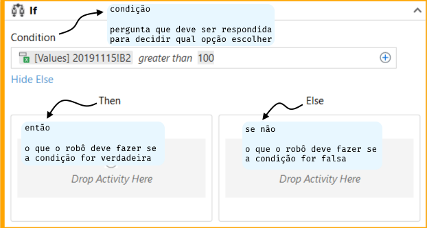

### Iterações com For Each

Iterações fazem com que o robô repita uma série de ações por determinada vezes.

No StudioX alguns tipos de atividades "for each" (para cada) que interagem com aplicativos diferentes, dentre eles:

**Excel For Each Row →** essa ação faz com que o robô itere por cada linha de um arquivo excel em um determinado range

**For Each Email →** essa ação faz com que o robô itere através de emails de uma pasta. Se pode criar filtros para, por exemplo, trabalhar somente com emails não lidos ou emails com um destinatário específico

**For Each File In Folder →** essa ação faz com que o robô itere através de todos os arquivos de uma pasta ou suas subpastas. Também se pode filtrar os arquivos que o robô irá escolher por nome os extensão. Ou pode escolher a order na qual os arquivos entrarão na iteração

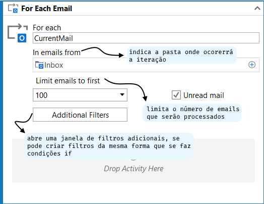

### Cenários com Switch

Ás vezes é necessário realizar ações diferentes de acordo com condições ou valores. Quando são só 2 opções diretas (uma condição de sim ou não) se pode usar o "If", porém em situações com mais opções é de melhor prática usar a atividade "Switch" para não encher a tela de atividades desnecessárias

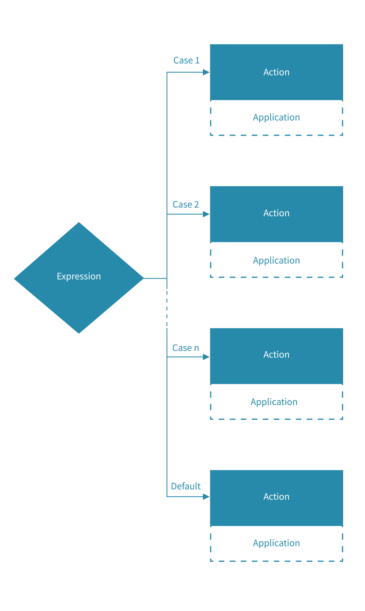

Switch é usado quando um item tem um valor que determina resultados diferentes. Se pode ter n casos, mas há sempre um caso padrão que cobre todas as situações que não foram contempladas pelos outros casos

Essa atividade funciona quando se sabe exatamente quais valores a expressão pode ter

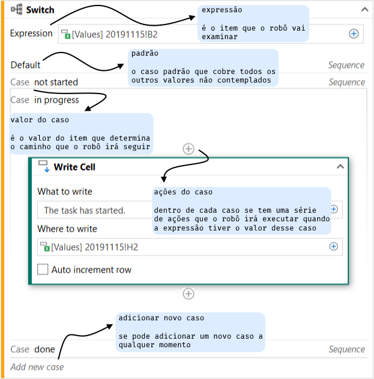

***

## Automação de Arquivos e Pastas

Ações como criar, copiar e renomear arquivos e pastas podem ser automatizados com uma série de passos simples

**Ações comuns para ambos (arquivos e pastas)**

- Copiar e mover de um local para outro
- Criar e deletar. Para criar um arquivo é necessário especificar a sua extensão após o nome
- Checar se um arquivo ou pasta existe. Se não existir, com o uso da atividade If, se pode criar ou mover ele de outro local

**Ações incomuns**

**Get File Info/Get Folder Info →** ação usada para obter as propriedades de um(a) arquivo/pasta (tamanho, caminho completo, nome, data de criação)
Com essa informação se pode adicionar um timestamp no nome do arquivo com a ajuda do "Project Notebook"

**For Each File In Folder →** ação para iterar por arquivos em pastas e suas subpastas. Essa atividade irá automaticamente obter as propriedades do arquivo atual

**Read Text File →** ação que copia todo o texto de um arquivo. Se pode salvar para usar depois, usar uma ação **Write Text File** para substituir o texto existente de outro documento ou usar **Append Line** para adiciona-lo no final de um documento existente