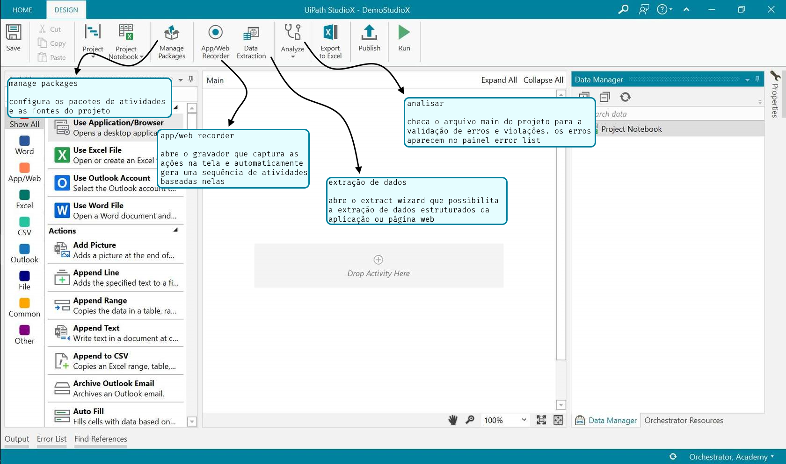
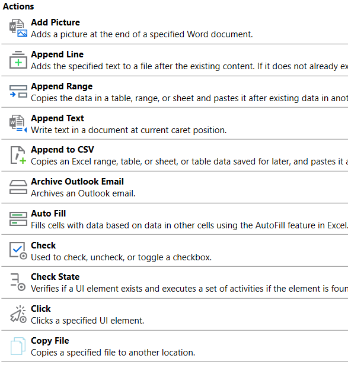

# UiPath StudioX

## Interface

***

## Anatomia de uma Atividade

Atividades são os blocos de construção da automação. É um grupo de instruções que o robô segue para performar a tarefa. O Studio e StudioX usam atividades para montar a automação

No StudioX existem 2 tipos de atividades, cada uma com seus próprios propósitos 

**Recursos ↓** 

São as atividades que dizem ao robô que aplicação usar. Essas são aplicativos dedicados, como Office apps, ou genéricos

Quando são dedicados, é necessário especificar o documento ou conta de email para que possam ser usados na automação

O genérico Application/Browser serve para indicar outros aplicativos e navegadores. Para indicar uma aplicação, ela já deve estar aberta (rodando)

**Ações ↓**

São atividades que dão ao robô instruções do que fazer com os recursos. São agrupados de acordo com o propósito da aplicação

Algumas ações dependem do recurso. Como exemplo, não se pode usar ações do Word em um arquivo Excel. As exceções são as ações comuns que podem ser usadas em qualquer aplicação e as ações de arquivo que não precisam de um recurso

As ações são nomeadas baseado nas ações comuns que performam em certas aplicações

***

## Diferença entre Step, Task and Process

**Steps (passos) →** é uma ação necessária para completar um propósito específico e bem definido

ex: baixar uma planilha 

**Tasks (tarefas) →** sequência de steps realizados por operador (humano/manual, robô/automatizado)

ex: juntar dados de 2 arquivos diferentes e salva em um novo arquivo numa pasta local

**Processes (processos) →** múltiplas, inter-relacionadas tarefas constroem um processo que almeja alcançar um objetivo maior. Pode ser um grupo de ambas tarefas automatizadas e manuais

ex: requisição de compra que precisa de múltiplos sistemas e requer validação humana para enviar 

***

## HumanPath para RobotPath

Framework que ajuda a organizar a tarefa de uma maneira visual. Também ajuda há traduzir a tarefa para o que é conhecido como "robot language" (linguagem do robô)

**HumanPath →** visualização high-level de tarefa em uma maneira sequencial

**RobotPath →** visualização detalhada, esta moldando o design dos steps que o robô leva para automatizar a tarefa

**Vantagens:**

- Quebra o processo em pequenos passos lógicos
- Ajuda a moldar o escopo do que se quer construir
- Outlines pontos de decisões-chave e cenários de tarefas de automação
- Serve para guiar na construção do robô 

##### Como usar?

**HumanPath**

- A tarefa deve sempre começar com um **Start**
- Tudo deve estar conectado com flechas, não deixe nada independente
- Cada passo deve ter uma etiqueta de aplicação, indicando onde cada ação acontece
- Todo começo tem um final, termine o flow com um **END**

**RobotPath**

- Deve começar de mesma forma que o HumanPath, com um **Start**
- Tudo deve estar conectado com flechas, não deixe nada independente
- Ás vezes o robô tem que tomar decisões entre 2 ou mais opções, dependente de uma condição de verificação, ou repetir ações para certo item
- Cada passo deve ter uma etiqueta de aplicação, indicando onde cada ação acontece
- Quebre cada passo a nível de clique. Todo passo deve ser precisamente definido e só pode ter um significado
- Os passos devem seguir uma ordem específica. Uma falha na ordem significa um resultado provavelmente incorreto
- Todo começo tem um final, termine o flow com um **END**

[Template para construir ambos os caminhos](HumanPath%20-%20RobotPath%20Templates%20-StudioX.pptx)

***